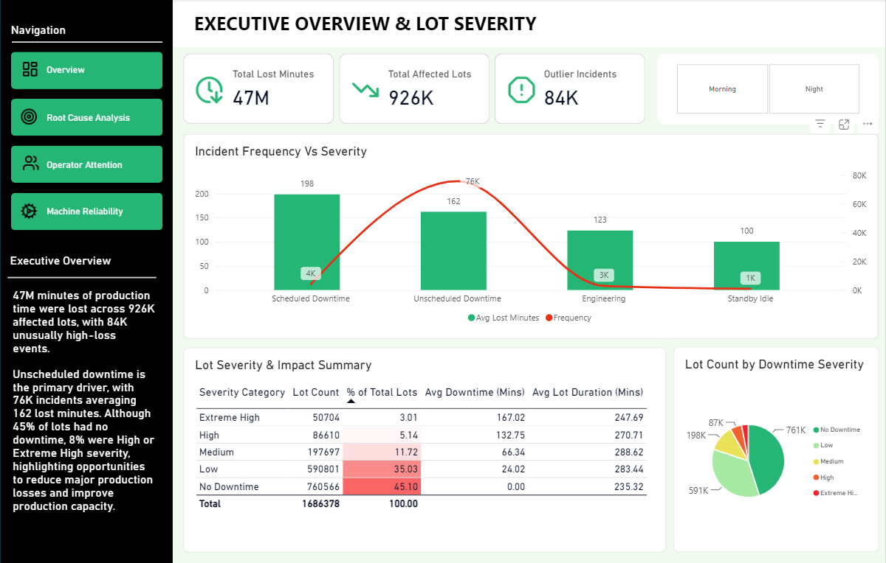
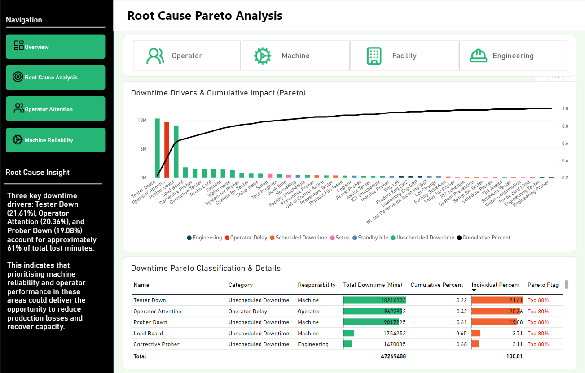
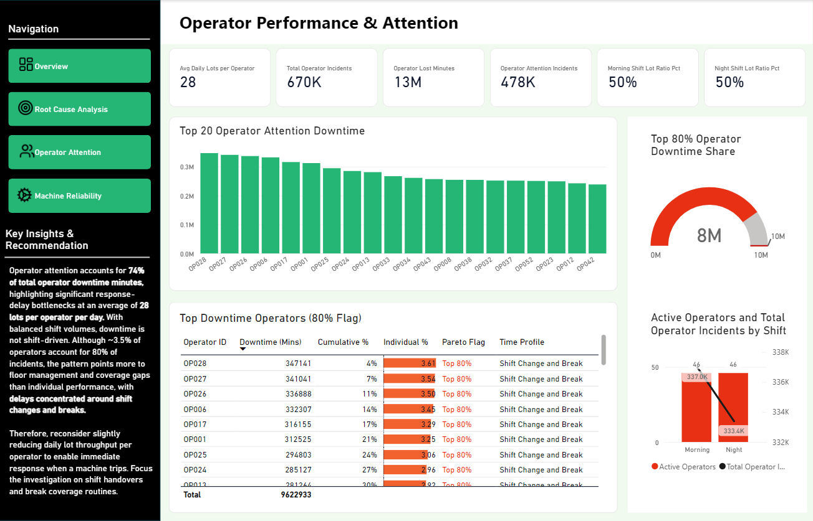
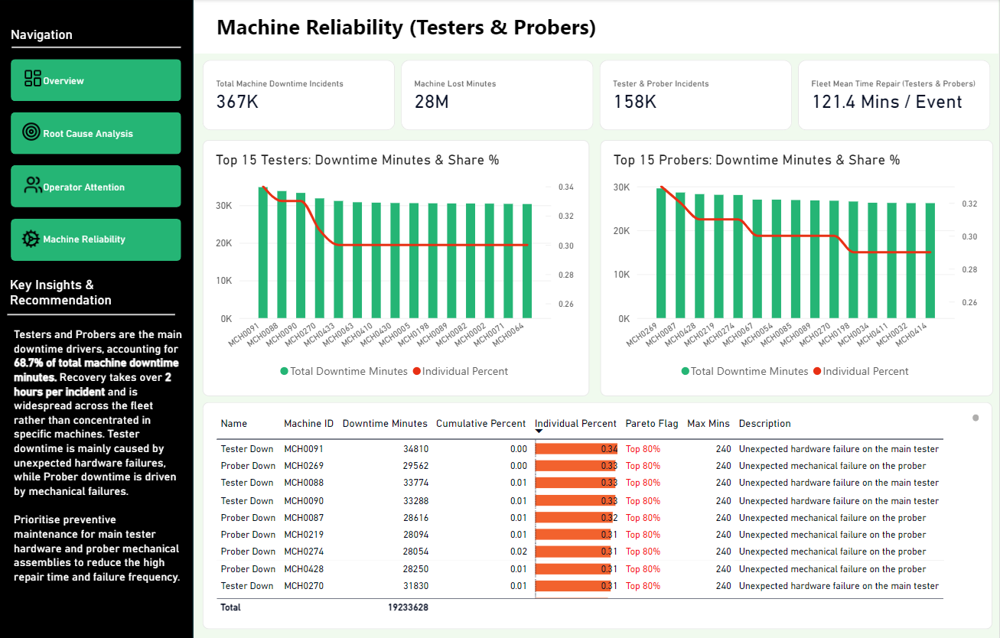

# Manufacture Downtime Analysis

## Project Overview

This project analyses production downtime in a wafer testing manufacturing environment to understand downtime events, affected lots, downtime duration, severity, and root causes. Using Power BI, the analysis applies Pareto analysis to identify the key drivers of downtime and their impact on production capacity.

The analysis focuses on operator attention and machine reliability (Testers & Probers), which together account for 61% of total downtime.

## Business Problem

The business needs to understand how much production time is affected by downtime, why downtime occurs, and which machines, operators, or shifts are key drivers of downtime.

The goal is to support data-driven decisions on the priority factors that should be addressed to reduce downtime events and durations and improve production capacity.

## Business Objectives

- Measure the impact of downtime on production time and affected lots.
- Identify the key drivers and root causes of downtime.
- Evaluate operator attention, machine reliability, and shift-related downtime patterns.
- Use Pareto analysis to prioritise the factors contributing most to downtime.
- Identify practical opportunities to reduce downtime and improve production capacity.

## Tools & Technologies

- SQL
- Power BI
- Power Query
- DAX
- Star Schema data modelling

## Data Analysis

The data was cleaned and transformed using SQL and structured into a Star Schema data model.

DAX measures were developed to analyse:

- Total lost minutes
- Total affected lots
- Total operator incidents
- Average daily lots per operator
- Morning/night staffing ratio
- Total machine downtime incidents
- Mean Time to Repair (MTTR) for Testers & Probers

The analysis was presented through a four-page interactive Power BI dashboard covering executive overview and lot severity, root cause analysis, operator performance and attention, and machine reliability.

## 📈 Dashboard Features

- **Executive Overview & Lot Severity**
  Provides an overview of total lost minutes, affected lots, outlier incidents, downtime frequency, and lot severity.
- **Root Cause Pareto Analysis**
  Identifies the major downtime drivers and their cumulative contribution to total downtime.
- **Operator Performance & Attention**
  Evaluates operator attention incidents, operator workload, shift patterns, and attention-related downtime.
- **Machine Reliability (Testers & Probers)**
  Analyses machine downtime, repair time, fleet-wide impact, and key failure modes for Testers and Probers.

## Business Insights

Operator attention accounts for 74% of total operator downtime mintues, indicating significant response-delay bottlenecks at an average of 28 lots per operator per day. Morning and night staffing ratios are balanced and incident volumes are similar, indicating that downtime is not shift-driven. Although approximately 3.5% of operators account for 80% of incidents, the pattern points more to floor-management and coverage gaps than individual performance, with delays concentrated around shift changes and breaks.

Testers and Probers are the main machine downtime drivers, accounting for 68.7% of total machine downtime minutes. Recovery takes over 2 hours per incident, with the impact widespread across the fleet rather than concentrated in specific machines. Tester downtime is mainly caused by unexpected hardware failures, while Prober downtime is driven by mechanical failures.

## Business Recommendations

- Reconsider slightly reducing daily lot throughput per operator to enable immediate response when a machine trips.
- Focus improvement efforts on shift handovers and break coverage routines.
- Prioritise preventive maintenance for main tester hardware and prober mechanical assemblies to reduce high repair times and failure frequency.

## Skills Demonstrated

- SQL data cleaning and transformation
- SQL data modelling and table relationships
- Pareto analysis using SQL
- Data preparation for Power BI
- DAX measure development
- Power BI data visualisation
- Interactive dashboard development
- Downtime and root cause analysis
- Operator performance analysis
- Machine reliability analysis
- Business insight generation and recommendations

## 📊 Power BI Dashboard

The interactive Power BI dashboard is available to explore through the preview images below.

**[Download the Power BI Dashboard (.pbix)](https://github.com/chowutyi2803-byte/manufacture-downtime-analysis/releases/tag/v1.0)**

## 📷 Dashboard Preview

### Executive Overview & Lot Severity

### Root Cause Pareto Analysis

### Operator Performance & Attention

### Machine Reliability (Testers & Probers)

## 🎯 Project Outcome

The analysis identifies operator attention and Testers & Probers as major areas contributing to production downtime. The findings provide management with focused priorities around operator response, shift handovers, break coverage, and preventive maintenance to support efforts to reduce downtime and improve production capacity.
